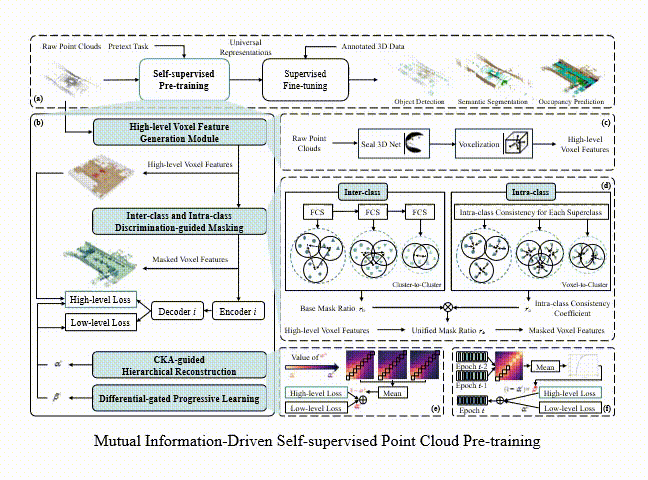

<div align=center>

</div>


 <h3 align="center"><strong>Mutual Information-Driven Self-supervised Point Cloud Pre-training</strong></h3>

------

  <p align="center">
    <strong>Weichen Xu, Tianhao Fu, Jian Cao, Xinyu Zhao, Xinxin Xu, Xixin Cao, Xing Zhang</strong></a>&nbsp;&nbsp;&nbsp;
    <br>
    School of Software and Microelectronics, Peking University, Beijing 100871, China&nbsp;&nbsp;&nbsp;<br>
    xuweichen1999@stu.pku.edu.cn, caojian@ss.pku.edu.cn 
  </p>
  <table align="center">
    <tr>
    <td>
      
    </td>
    </tr>
  </table>


## :books:Outline

- [Location of Key Codes](#sparkles-location-of-key-codes)
- [Main Results](#car-main-results)
- [Getting Start](#%EF%B8%8Fgetting-start)
  - [1. Download Weights of MinkUNet (Res16UNet34C) Pre-trained by Seal](#%EF%B8%8F1-download-weights-of-minkunet-res16unet34c-pre-trained-by-seal)
  - [2. Prepare Dataset](#%EF%B8%8F2-prepare--dataset)
  - [3. Prepare the Environment](#%EF%B8%8F3-prepare-the-environment)
  - [4. Prepare the Seal Feature for the Entire Dataset Offline](#%EF%B8%8F4-prepare-the-seal-feature-for-the-entire-dataset-offline)
  - [5. Run the Code](#rocket5-run-the-code)


## :sparkles: Location of Key Codes

In [pcdet/models/dense_heads/pretrain_head_3D_seal.py](pcdet/models/dense_heads/pretrain_head_3D_seal.py), we provide the implementations of `High-level Voxel Feature Generation Module`, which involves the processes of data extraction, voxelization, as well as the computation of the target and loss.

In [pcdet/models/backbones_3d/I2Mask.py](pcdet/models/backbones_3d/I2Mask.py) and [pcdet/models/backbones_3d/dsvt_backbone_mae.py](pcdet/models/backbones_3d/dsvt_backbone_mae.py), we provide the implementations of  `Inter-class and Intra-class Discrimination-guided Masking` (I$^2$Mask).

In [pcdet/utils/cka_alhpa.py](pcdet/utils/cka_alhpa.py)and [pcdet/models/dense_heads/pretrain_head_3D_seal.py L172](pcdet/models/dense_heads/pretrain_head_3D_seal.py), we provide the implementations of `CKA-guided Hierarchical Reconstruction`.

In [pcdet/models/dense_heads/pretrain_head_3D_seal.py L167 def differential_gated_progressive_learning](pcdet/models/dense_heads/pretrain_head_3D_seal.py), we provide the implementations of `Differential-gated Progressive Learning`.

We provide all the configuration files in the paper and appendix in [tools/cfgs/gpicture_models/](tools/cfgs/gpicture_models/). 

👆 [BACK to Table of Contents -->](#booksoutline)

 

## :car: Main Results

**Pre-training**

Waymo

| Model                                                        | Pre-train Fraction |                       Pre-train model                        |                             Log                              |
| ------------------------------------------------------------ | :----------------: | :----------------------------------------------------------: | :----------------------------------------------------------: |
| [GPICTURE (DSVT)](tools/cfgs/gpicture_models/gpicture_waymo_ssl_seal_decoder_mask_0.2.yaml) |        20%         | [ckpt](https://www.dropbox.com/scl/fi/1p0jrnsprlwtimihpg2x9/pretrain_dsvt_waymo_0.2.pth?rlkey=ehqz5rxycihw1kz9ewx9k6jyi&st=6kjzz1w6&dl=0) | [Log](https://www.dropbox.com/scl/fi/y90jnjs44mq46bgyjthjj/log_train_20240602-141005-pretrain_waymo_0.2.txt?rlkey=qskks9bu0hoisq1bd1i9f82bl&st=nvcpl0ox&dl=0) |
| [GPICTURE (DSVT)](tools/cfgs/gpicture_models/gpicture_waymo_ssl_seal_decoder_mask.yaml) |        100%        | [ckpt](https://www.dropbox.com/scl/fi/zv28qz1meohwcg9jb4ai7/pretrain_dsvt_waymo.pth?rlkey=tclwucxm66rivhmngz5tnsi9f&st=qdmecs4t&dl=0) | [Log](https://www.dropbox.com/scl/fi/a7m8myob7595drjui1ah5/log_train_20240621-082115-pretrain_waymo.txt?rlkey=3n0shv54ze5uwlmzamc3706wf&st=kcc9ktjr&dl=0) |

nuScenes

| Model                                                        |                       Pre-train model                        |                             Log                              |
| ------------------------------------------------------------ | :----------------------------------------------------------: | :----------------------------------------------------------: |
| [GPICTURE (DSVT)](tools/cfgs/gpicture_models/gpicture_nuscenes_ssl_seal_decoder_mask.yaml) | [ckpt](https://www.dropbox.com/scl/fi/g1isvgnwexlymqwaqdo22/pretrain_dsvt_nuscenes.pth?rlkey=ubmvmtwoff3l1jp76ls0udy1j&st=5v3swgd7&dl=0) | [Log](https://www.dropbox.com/scl/fi/1hoyr8hhomb4m6bvcclaa/log_train_20240705-105152-pretrain_nuscenes.txt?rlkey=uq142mzjjgtybq5giqrpzwqaz&st=cmc2lsdu&dl=0) |


**Fine-tuning**

3D Object Detection (on Waymo validation)

| Model                                                        | Pre-train Fraction |  mAP/H_L2   |   Veh_L2    |   Ped_L2    |   Cyc_L2    |                             ckpt                             |                             Log                              |
| ------------------------------------------------------------ | :----------------: | :---------: | :---------: | :---------: | :---------: | :----------------------------------------------------------: | :----------------------------------------------------------: |
| [DSVT (GPICTURE)](tools/cfgs/gpicture_models/gpicture_waymo_detection_0.2.yaml) |        20%         | 73.84/71.75 | 71.55/71.22 | 75.99/70.61 | 73.98/73.42 | [ckpt](https://www.dropbox.com/scl/fi/lerb4emu5ced4as0f3f54/finetune_dsvt_waymo_detection_0.2.pth?rlkey=b8k2xn2p3wnojaaxw80bo9aee&st=bf5u42yb&dl=0) | [Log](https://www.dropbox.com/scl/fi/3zf55q16w3xanzdub8783/log_train_20240614-133337-finetune_waymo_detection_0.2.txt?rlkey=l3jj8fgpv5v4a0d20p8795fx0&st=9txchfns&dl=0) |
| [DSVT (GPICTURE)](tools/cfgs/gpicture_models/gpicture_waymo_detection.yaml) |        100%        | 75.55/73.13 | 73.38/72.87 | 77.52/72.01 | 75.75/74.51 | [ckpt](https://www.dropbox.com/scl/fi/dtrlzu764z1qnbxpz68r8/finetune_dsvt_waymo_detection.pth?rlkey=g78nx360a9twmsnu7tcebenfv&st=ou8jo1rw&dl=0) | [Log](https://www.dropbox.com/scl/fi/0b3609qycqq6blvz2yfjt/log_train_20240626-093422-finetune_waymo_detection.txt?rlkey=jvib09ga50x67t4a071ahonhp&st=8t1gflzl&dl=0) |

3D Object Detection (on nuScenes validation)

| Model                                                        | mAP  | NDS  | mATE | mASE | mAOE | mAVE | mAAE |                             ckpt                             |                             Log                              |
| ------------------------------------------------------------ | :--: | :--: | :--: | :--: | :--: | :--: | :--: | :----------------------------------------------------------: | :----------------------------------------------------------: |
| [DSVT (GPICTURE)](tools/cfgs/gpicture_models/gpicture_nuscenes_detection.yaml) | 68.6 | 73.0 | 25.5 | 23.8 | 25.8 | 20.7 | 17.4 | [ckpt](https://www.dropbox.com/scl/fi/c2lvls942ytyygkl6kxnt/finetune_dsvt_nuscenes_detection.pth?rlkey=jodlym7pxgsy5qxcu4sehfkg7&st=26p2ji7f&dl=0) | [Log](https://www.dropbox.com/scl/fi/ik5vav74sm8e2gscvd58t/log_train_20240712-154208-finetune_nuscenes_detection.txt?rlkey=lisztc4w1i9r47ldt8g2le0ty&st=w0g5y8us&dl=0) |

3D Semantic Segmentation (on nuScenes validation)

| Model                                                        | mIoU | Bicycle | Bus  | Car  | Motorcycle | Pedestrian | Trailer | Truck |                             ckpt                             |                             Log                              |
| ------------------------------------------------------------ | :--: | :-----: | :--: | :--: | :--------: | :--------: | :-----: | :---: | :----------------------------------------------------------: | :----------------------------------------------------------: |
| [Cylinder3D-SST (GPICTURE)](tools/cfgs/gpicture_models/gpicture_nuscenes_segmentation.yaml) | 79.7 |  43.6   | 94.8 | 96.5 |    81.0    |    84.4    |  65.8   | 87.7  | [ckpt](https://www.dropbox.com/scl/fi/c91fddakds0w4pl6drut3/finetune_dsvt_nuscenes_segmentation.pth?rlkey=vf5hkizjb5c2zoxbvijvip581&st=mi09bzth&dl=0) | [Log](https://www.dropbox.com/scl/fi/17ehaccwnhgtzip2hhhcf/log_train_20240716-092123-finetune_nuscenes_segmentation.txt?rlkey=3mwonhmjinzwv5tpy1krxlnc8&st=qdcqsdnr&dl=0) |

Occupancy Prediction (on nuScenes OpenOccupancy validation)

| Model                                                        | mIoU | Bicycle | Bus  | Car  | Motorcycle | Pedestrian | Trailer | Truck |                             ckpt                             |                             Log                              |
| ------------------------------------------------------------ | :--: | :-----: | :--: | :--: | :--------: | :--------: | :-----: | :---: | :----------------------------------------------------------: | :----------------------------------------------------------: |
| [DSVT (GPICTURE)](tools/cfgs/gpicture_models/gpicture_nuscenes_occupancy.yaml) | 18.8 |   8.4   | 16.2 | 21.1 |    7.9     |    12.8    |  15.9   | 16.3  | [ckpt](https://www.dropbox.com/scl/fi/hlp6ngt0j7jtuxb10ie4a/finetune_dsvt_nuscenes_occupancy.pth?rlkey=yin8066z1sxx0ydbwix6650vl&st=hb096t6a&dl=0) | [Log](https://www.dropbox.com/scl/fi/rrn3qckbbr9uut08ywmsx/log_train_20240721-142502-finetune_nuscenes_occupancy.txt?rlkey=6fd768epnbdhjiaatsgv07h6g&st=kzgpv5sg&dl=0) |

👆 [BACK to Table of Contents -->](#booksoutline)


## 🏃‍♂️Getting Start

### ⬇️1. Download Weights of MinkUNet (Res16UNet34C) Pre-trained by Seal

[youquanl/Segment-Any-Point-Cloud: NeurIPS'23 Spotlight\] Segment Any Point Cloud Sequences by Distilling Vision Foundation Models (github.com)](https://github.com/youquanl/Segment-Any-Point-Cloud)

After downloading, please put it into project path

👆 [BACK to Table of Contents -->](#booksoutline)


### ⚒️2. Prepare  Dataset

**Waymo**：

1.Download the Waymo dataset from the [official Waymo website](https://waymo.com/open/download/), and make sure to download version 1.2.0 of Perception Dataset.

2.Prepare the directory as follows:

```
GPICTURE
├── data
│   ├── waymo
│   │   │── ImageSets
│   │   │── raw_data
│   │   │   │── segment-xxxxxxxx.tfrecord
|   |   |   |── ...
├── pcdet
├── tools
```

3.Prepare the environment and install `waymo-open-dataset`:

```
pip install waymo-open-dataset-tf-2-5-0
```

4.Generate the complete dataset. It require approximately 1T disk and 100G RAM.

```shell
# only for single-frame setting
python -m pcdet.datasets.waymo.waymo_dataset --func create_waymo_infos \
    --cfg_file tools/cfgs/dataset_configs/waymo_dataset.yaml

# for single-frame or multi-frame setting
python -m pcdet.datasets.waymo.waymo_dataset --func create_waymo_infos --cfg_file tools/cfgs/dataset_configs/waymo_dataset_multiframe.yaml
# Ignore 'CUDA_ERROR_NO_DEVICE' error as this process does not require GPU.
```


**nuScenes**：

1.Prepare the `trainval` dataset from [nuScenes](https://www.nuscenes.org/nuscenes#download) and prepare the directory as follows:

```shell
GPICTURE
├── data
│   ├── nuscenes
│   │   │── v1.0-trainval
│   │   │   │── samples
│   │   │   │── sweeps
│   │   │   │── maps
│   │   │   │── v1.0-trainval  
├── pcdet
├── tools
```

2.Prepare the environment and install `nuscenes-devkit`：

```
pip install nuscenes-devkit==1.0.5
```

3.Generate the complete dataset.

```shell
# for lidar-only setting
python -m pcdet.datasets.nuscenes.nuscenes_dataset --func create_nuscenes_infos --cfg_file tools/cfgs/dataset_configs/nuscenes_dataset.yaml --version v1.0-trainval
```


**nuScenes Lidarseg**：

1.Download the annotation files from [nuScenes](https://www.nuscenes.org/nuscenes#download) and prepare the directory as follows:

```
GPICTURE
├── data
│   ├── nuscenes
│   │   │── v1.0-trainval
│   │   │   │── samples
│   │   │   │── sweeps
│   │   │   │── maps
│   │   │   │── v1.0-trainval  
│   │   │   │   │── lidarseg.json
│   │   │   │   │── category.json
│   │   │── lidarseg
│   │   │   │── v1.0-trainval  
├── pcdet
├── tools
```


**nuScenes OpenOccupancy**：

1.Download the annotation files from [OpenOccupancy](https://github.com/JeffWang987/OpenOccupancy/blob/main/docs/prepare_data.md) and prepare the directory as follows:

```
GPICTURE
├── data
│   ├── nuscenes
│   │   │── v1.0-trainval
│   │   │   │── samples
│   │   │   │── sweeps
│   │   │   │── maps
│   │   │   │── v1.0-trainval  
│   │   │   │   │── lidarseg.json
│   │   │   │   │── category.json
│   │── nuScenes-Occupancy
├── pcdet
├── tools
```

2.Prepare the environment:

```shell
conda install -c omgarcia gcc-6 # gcc-6.2
pip install mmcv-full==1.4.0
pip install mmdet==2.14.0
pip install mmsegmentation==0.14.1

# Install mmdet3d from source code.
git clone https://github.com/open-mmlab/mmdetection3d.git
cd mmdetection3d
git checkout v0.17.1 # Other versions may not be compatible.
python setup.py install

# Install occupancy pooling.
git clone https://github.com/JeffWang987/OpenOccupancy.git
cd OpenOccupancy
export PYTHONPATH=“.”
python setup.py develop
```

👆 [BACK to Table of Contents -->](#booksoutline)


### ⚒️3. Prepare the Environment

1. create environment and install pytorch

```shell
conda create --name gpicture python=3.8
conda activate gpicture
# install pytorch
conda install pytorch==1.10.1 torchvision==0.11.2 torchaudio==0.10.1 cudatoolkit=11.1 -c pytorch -c conda-forge
# Verify if pytorch is installed
import torch 
print(torch.cuda.is_available()) # If normal, return "True"
import torch    # If normal, remain silent
a = torch.Tensor([1.])    # If normal, remain silent
a.cuda()    # If normal, return"tensor([ 1.], device='cuda:0')"
from torch.backends import cudnn # If normal, remain silent
cudnn.is_acceptable(a.cuda())    # If normal, return "True"

```

2.install OpenPCDet

```shell
# install spconv
pip install spconv-cu111
# install requirements
pip install -r requirements.txt
# setup
python setup.py develop
```

3.install other packages

```shell
# install other packages
pip install torch_scatter
pip install nuscenes-devkit==1.0.5
pip install open3d

# install the Python package for evaluating the Waymo dataset
pip install waymo-open-dataset-tf-2-5-0==1.4.1

# pay attention to specific package versions.
pip install pandas==1.4.3
pip install matplotlib==3.6.2
pip install scikit-image==0.19.3
pip install async-lru==1.0.3

# install CUDA extensions
cd common_ops
pip install .
```

4.install MinkowskiEngine

```shell
# install MinkowskiEngine
pip install ninja
conda install openblas-devel -c anaconda
git clone https://github.com/NVIDIA/MinkowskiEngine.git
cd MinkowskiEngine
python setup.py install --blas_include_dirs=${CONDA_PREFIX}/include --blas=openblas
```

👆 [BACK to Table of Contents -->](#booksoutline)


### ⚒️4. Prepare the Seal Feature for the Entire Dataset Offline

1.Prepare the `coords` and `feats` inputs.

```shell
cd tools/
python train.py --cfg_file cfgs/gpicture_models/gpicture_waymo_ssl_seal_generate_input.yaml
# or
python train.py --cfg_file cfgs/gpicture_models/gpicture_nuscenes_ssl_seal_generate_input.yaml
```

2.Utilize the MinkUNet (Res16UNet34C) pre-trained by Seal to generate the Seal features.

```shell
cd tools/
python prepare_seal_output.py
```

👆 [BACK to Table of Contents -->](#booksoutline)


### :rocket:5. Run the Code

We provide the configuration files in the paper and appendix in [tools/cfgs/gpicture_models/](tools/cfgs/gpicture_models/).

**Pre-training**

Waymo

```shell
cd tools/
python train.py --cfg_file cfgs/gpicture_models/gpicture_waymo_ssl_seal_decoder_mask.yaml
```

nuScenes

```shell
cd tools/
python train.py --cfg_file cfgs/gpicture_models/gpicture_nuscenes_ssl_seal_decoder_mask.yaml
```


**Fine-tuning**

3D Object Detection on Waymo:

```shell
cd tools/
python train.py --cfg_file cfgs/gpicture_models/gpicture_waymo_detection.yaml --pretrained_model /path/of/pretrain/model.pth
```

3D Object Detection on nuScenes:

```shell
cd tools/
python train.py --cfg_file cfgs/gpicture_models/gpicture_nuscenes_detection.yaml --pretrained_model /path/of/pretrain/model.pth
```


3D Semantic Segmentation:

```shell
cd tools/
python train.py --cfg_file cfgs/gpicture_models/gpicture_nuscenes_segmentation.yaml --pretrained_model /path/of/pretrain/model.pth
```


Occupancy Prediction:

```shell
cd tools/
python train.py --cfg_file cfgs/gpicture_models/gpicture_nuscenes_occupancy.yaml --pretrained_model /path/of/pretrain/model.pth
```

👆 [BACK to Table of Contents -->](#booksoutline)
